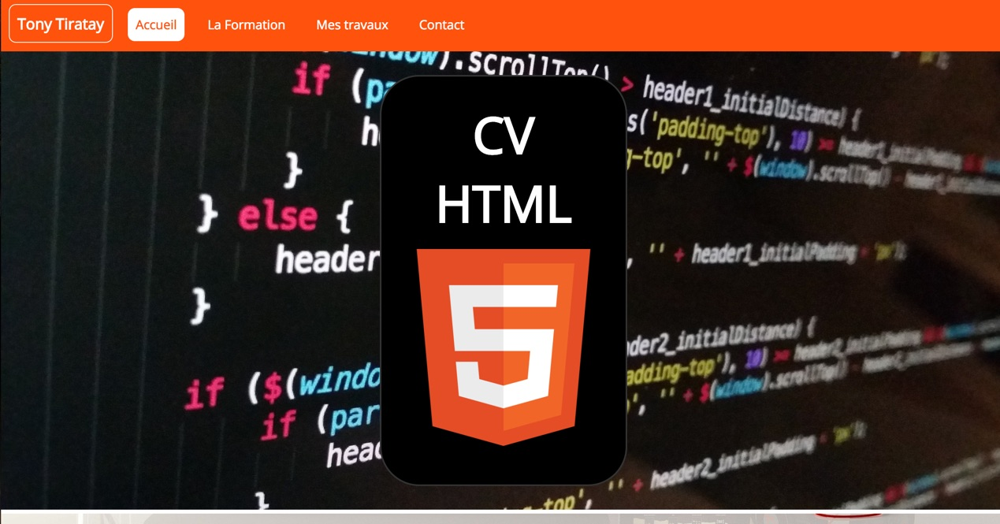

# Créer un CV en HTML5 et CSS3



## Objectif

 Le but de cet exercice est de créer votrez CV, en HTML5 et CS33. Nous n'allons pas du tout aborder le contenu pour cette semaine, mais uniquement la structure.

 Vous pouvez télécharger l'ensemble de ce dossier qui contient déjà les différents éléments que vous aurez à utiliser (notamment les images.)

## Détails

Le site devra être "one page", c'est à dire que toutes les sections sont sur une seule et même page. Au total, il y a 4 sections différentes.

* Accueil
* Formation
* Travaux
* Contact

## Consignes

Réalisez le site à l'aide du cahier des charges ci-dessous.

### Navigation

Une barre de menu contient des liens vers les différentes sections de la page, ainsi qu'une zone "logo" qui affiche votre prénom et votre nom.

* Logo (Nom + prénom)
* Accueil
* Formation
* Travaux
* Contact

Vous trouverez le détail des informations de style détaillées en fin d'exerice.

### Accueil

Cette section est la première, tout en haut du site. Elle contient un gros titre (h1) "CV HTML" ainsi qu'une image (fournie) en fond. Utilisez l'image cv-bg-3.jpg

### formation

Deuxième section du site, elle contient un h1 affichant "Formation". L'image de fond de cette section est cv-bg-1.jpg.

### travaux

Troisème section, qui ne contient elle aussi qu'un titre h1 affichant "Travaux". L'image de fond est cv-bg-4.jpg.

## Contact

Quatrième et dernière section, le titre est toujours, vous vous en doutez, un h1, dont le texte est... "Contact". L'image à utiliser est donc cv-bg-2.jpg.

## Informations de mise en forme

### La barre de menu

```
Couleur de fond: Orange.
Hauteur: 70px.
Marge intérieur à gauche: 10px.
Couleur des liens: blanc.
Position fixe en haut du site (ne défile pas quand la page défile)
```

**Boutons de menu**

```
Marge intérieur: 10px.
Marge extérieur droite: 15px.
Liens: Pas de soulignement.
Bordure arrondie (9px) blanche.
```

**Boutons de menu au survol**

```
Couleur de fond: blanc.
Couleur du texte: Même orange que le menu.

```

**Bouton Logo**

```
Aucun effet au survol.
Taille du texte: 1.2em
MArge intérieur: 10px;
Marge extérieur droite: 15px;
Texte et bordure: blanc
Arrondi bordure: 9px
```
### Sections

**Toutes les sections**

Toutes les sections ont des propriétés communes. Les seules choses qui changent entre elles sont le contenu du titre, et l'image de fond. Voici les caractéristiques communes :

```
Marge intérieur: 30px;
Hauteur minimum: 700px
Les éléments à l'intérieur de chaque section sont centrés, horizontalement, et verticalement.
Les images de fond sont fixes (elles ne défilent pas alors que le contenu des sections si) et ont une taille qui couvre entièrmeent la section, quelle que soit la taille de la fenêtre du navigateur.
```

### Gros titre de section

```
marge extérieur: aucune;
alignement: centré
Taille du texte: 4em;
Couleur de fond: noir avec une opacité de 60%.
Couleur du texte: blanc
Bordure de 2px, blanche, arrondie (50px)
```
> Le gros titre de la section accueil a une particularité, il contient en son sein une image. En HTML, il est tout à fait possible de mettre une balise img à l'intérieur d'une balise h1, et c'est le cas pour cette section.
> ATTENTION ! l'image du titre (le logo html5) doit avoir une marge extérieur au dessus de 15px, et l'image doit avoir une largeur de 180px;

## Quelques tuyaux pour vous aider.

Pour la couleur de fond des gros titre, avec une opacité à 60%, il faut faire une petite recherche sur le "rgba" en css. Attention de ne pas modifier l'opacité du titre en entier (avec la propriété opacity), mais bien uniquement la couleur de fond.

Pour les images fixes en fond de section, je vous invite à rechercher des informations sur la propriété "background-attachment".

Pour l'image de fond qui doit prendre toute la place quelle que soit la taille de la fenêtre du navigateur, chercher des infos sur la propriété "background-size" :)

## Pour aller un peu plus loin

Essayer d'intégrer la police (webfont) de Google 'open-sans'. Vous n'êtes pas obligé de la faire de suite, mais vous pouvez prendre de l'avance en faisant quelques recherches sur l'intégration de polices webfont :)

Si vous n'êtes pas sur de savoir à quoi doit ressembler le site, vous trouverez des captures d'écran de toutes les sections dans le dossier exercice.
